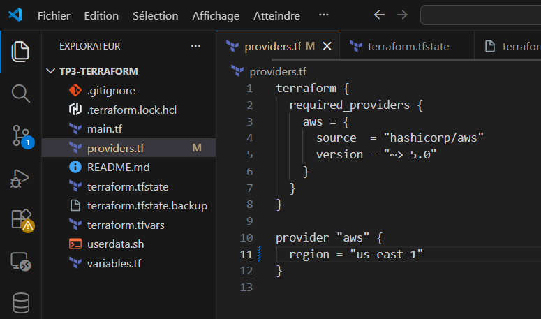
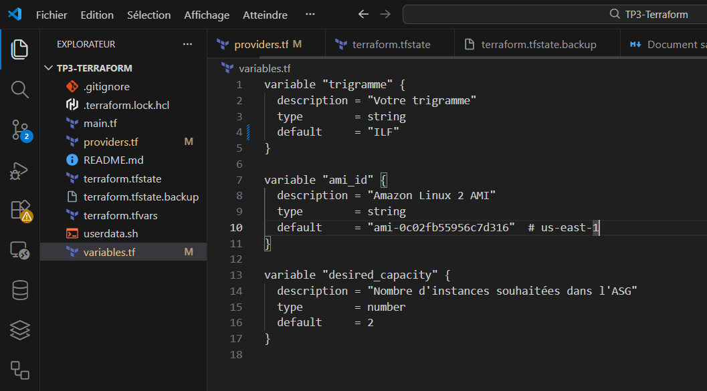
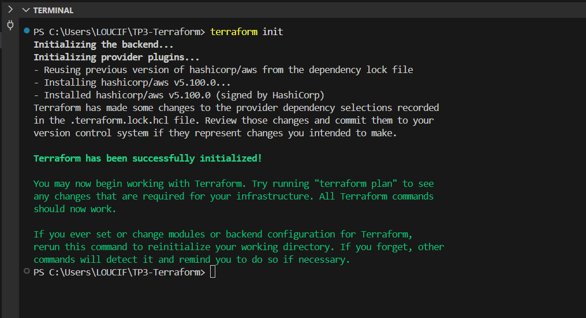

# TP Terraform

Ce TP a consisté à créer une infrastructure AWS scalable avec Terraform utilisant un Auto Scaling Group, un Application Load Balancer et des instances EC2 automatisées. Le trigramme `ILF` a été utilisé pour toutes les ressources.

## Étape 1 : Préparation de l’environnement

Configuration de l’AWS CLI et de la console en anglais (US).  
Création des fichiers Terraform suivants :

- **providers.tf** : provider AWS en région `us-east-1`.
- **variables.tf** : `trigramme = "ILF"`, `ami_id = "ami-0c02fb55956c7d316"` (Amazon Linux 2), `desired_capacity = 2`.
- **main.tf** : infrastructure complète (VPC, subnets, IGW, route table, security groups, ALB, target group, listener, launch template, ASG).
- **userdata.sh** : script bash installant `httpd` et générant un `index.html` dynamique avec l’ID de l’instance et le trigramme.
- **terraform.tfvars** : affectation de la valeur `trigramme = "ILF"`.

Commandes utilisées :

terraform init
terraform validate

**Captures :**

  
  

---

## Étape 2 : Planification et déploiement initial

Planification :

terraform plan

**Résultat :** 15 ressources prévues (1 VPC, 2 subnets publics, 1 IGW, 1 route table + 2 associations, 2 security groups, 1 ALB, 1 target group, 1 listener, 1 launch template, 1 Auto Scaling Group).[file:28]

Déploiement :

terraform apply

**Déploiement réussi** créant l’infrastructure avec 2 instances EC2 (`desired_capacity = 2`) dans l’ASG `ILF-asg`.[file:23]

**Captures :**

  

---

## Étape 3 : Architecture créée

L’infrastructure obtenue :

- **VPC** : `ILF_vpc` (`10.0.0.0/16`)
- **Subnets publics** : `ILF_public_a` (us-east-1a), `ILF_public_b` (us-east-1b)
- **Application Load Balancer** : `ILF-alb` exposé sur le port 80
- **Target Group** : `ILF-tg` avec health checks HTTP/200)
- **Auto Scaling Group** : `ILF-asg` (min = 1, max = 3, desired = 2) basé sur le launch template `ILF-lt`
- **Security Groups** :
  - `ILF_alb_sg` : HTTP Internet → ALB
  - `ILF_inst_sg` : HTTP ALB → instances.[file:22]

**Capture :**

---

## Étape 4 : Test de scaling

Test d’augmentation de capacité :

terraform apply -var="desired_capacity=3"

Cette commande met à jour l’ASG pour lancer 3 instances EC2, qui s’enregistrent automatiquement dans le target group via les health checks de l’ALB.[file:25][file:21]

**Captures :**

  

---

## Étape 5 : Vérifications

- Accès au DNS de l’ALB pour observer la rotation entre les instances et l’affichage de `Trigramme: ILF` avec l’ID de l’instance.
- Vérification dans la console AWS :
  - ASG `ILF-asg` : instances en `InService`.
  - Target group `ILF-tg` : cibles en `healthy`.
  - ALB `ILF-alb` : listener HTTP sur le port 80.[file:21][file:22]

---

## Étape 6 : Nettoyage

Destruction complète de l’infrastructure :

terraform destroy
